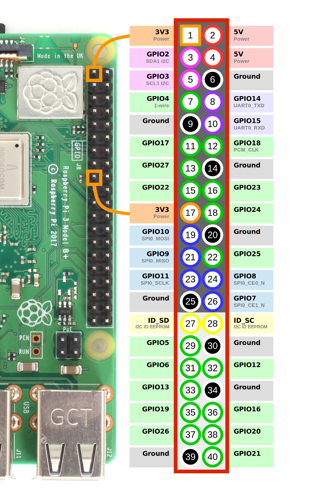

# install raspbian
* download raspberry pi imager from [here](https://www.raspberrypi.com/software/)
* install raspberry 32 bit lite on sd card

# configure raspbian
* fill ssid & password in wpa_supplicant.conf file in config folder
* copy all files in config folder into the root directory of the sd card:
```
cp config/* /Volumes/boot
```
* at the end of config.txt in root directory of the sd card add 'enable_uart=1'
```
echo "enable_uart=1" >> /Volumes/boot/config.txt
```
* at the beginning of cmdline.txt in root directory of the sd card add 'dwc_otg.lpm_enable=0'
```
sed -i 'dwc_otg.lpm_enable=0\n/' /Volumes/boot/cmdline.txt
```

# login
## uart login
* you need to connect the pins 
  * ground (6) to ground on usb uart
  * tx (8) to rx on usb uart
  * rx (6) to tx on usb uart


* the usb port that is being used can be found with
```
ls /dev | grep usbserial
```

* you can monitor the logs with the command
```
screen -L /dev/tty.usbserial-0001 115200 
```

## ssh login
* the ip address that is being used can be found with (zenmap tool works well too):
```
nmap -sn 192.168.0.0/128
```
and then
```
ssh pi@ip
```
note can be logged in also with
```
ssh jsoto@92.89.86.97 -p 80
```
or
```
ssh jsoto@92.89.86.97
```

## actual login
* first login can be done with login: pi and pwd: raspberry

# configure system
## create custom user
* to create a customer user run
```
sudo adduser jsoto
sudo usermod -aG sudo jsoto
```

* logout as pi user, login as jsoto and remove pi user for security purposes
```
sudo userdel pi
```

## install docker
* to install docker run
```
curl -fsSL https://get.docker.com -o get-docker.sh
sudo sh get-docker.sh
sudo usermod -aG docker jsoto
```
* check docker is installed
```
```
## install docker-compose
* to install docker-compose run
```
sudo apt-get install --yes libffi-dev libssl-dev python3 python3-pip python3-dev
sudo pip3 install docker-compose
```
* check docker-compose is installed
```
docker-compose --version
```